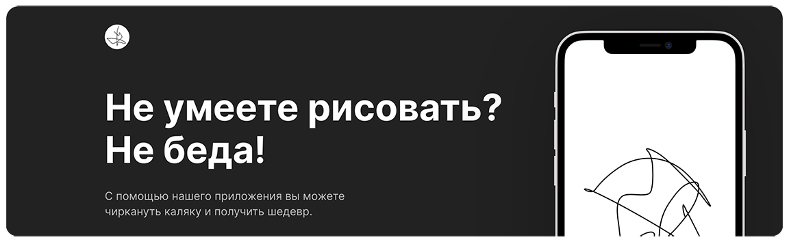

<h1 align="center"></h1>

## Краткое описание:

 Лендинг о мобильном приложении, которое с помощью нейронных сетей улучшает рисинки пользователя. Лендинг создан в рамках обучения в Яндекс.Практикуме по направлению "Веб-разработчик плюс".

[Открыть в браузере](http://rochernikov.github.io/chik-chirik/)

### Функционал:

- Слайдеры в мобильной версии страницы.

### Технологии, использованные при создании:

- Flexbox
- Grid Layout
- CSS3 (в т.ч. анимации)
- Препроцессор (SCSS)
- Методология BEM
- Файловая структура BEM Nested
- JavaScript (ES6): работа с DOM, массивы и функции
- Используется библиотека Swiper JS для реализации слайдеров (в мобильной версии).
- Реализация отзывчивого дизайна (desktop-first)
- Работа с Figma (pixel-perfect верстка)
- Webpack

### Языки:

- HTML
- CSS
- SCSS
- JavaScript

### Внешние компоненты

Для работы с проектом вам понадобятся git, NodeJS

- [Как установить git.](https://git-scm.com/book/en/v2/Getting-Started-Installing-Git)
- [Как установить NodeJS.](https://nodejs.org/en/download/package-manager/)
- Инструкция по установке Webpack ниже:

### Локальная установка:

В командной строке перейдите в папку, где будет развернут проект. После чего скопируйте его с GitHub:
`$ git clone git@github.com:RoChernikov/chik-chirik.git`

Далее переходим в папку с проектом и устанавливаем компоненты:
`$ npm install`

После этого нужно собрать проект:
`$ npm run build`

Далее можно запускать проект на локальном сервере:
`$ npm run dev`

### В конфигурационном файле package.json настроены три варианта запуска сборки проекта:

`$ npm run build` - для компиляции. Проект собирается локально, продукты сборки сохряняются в указанной директории.

`$ npm run dev` - для отладки. Помимо сборки, запускает на локальном сервере с автоматической <<горячей>> перезагрузкой при детектировании изменений в исходных кодах.

`$ npm run deploy` - для релиза. Выкладывает релизную версию в ветку `gh-pages` указанного репозитория.

### Установка сборщика (Webpack)

`npm init` - _добаляет конфигурационный файл package.json по умолчанию_

`npm i webpack --save-dev` - _устанавливает пакет webpack в проект, записывает его в зависимости для разработки_

`npm i webpack-cli --save-dev` - _устанавливает пакет интерфейса командной строки для webpack'а_

`npm i webpack-dev-server --save-dev` - _устанавливает пакет локального сервера_

### Установка транспилятора (Babel)

`npm i babel-loader --save-dev` - _устанавливает пакет транспилятора_

Дополнительные пакеты для работы с транспилятором:

`npm i @babel/cli --save-dev`

`npm i @babel/core --save-dev`

`npm i @babel/preset-env --save-dev`

`npm i core-js@3.4.1 --save`

`npm install --save babel-polyfill` - _устанавливает полифилы для транспилятора_

### Установка минификатора

`npm i mini-css-extract-plugin --save-dev` - _устанавливает пакет минификатора_

`npm i css-loader --save-dev` - _устанавливает пакет CSS-загрузчика_

### Установка "горячей" перезагрузки

`npm i webpack-md5-hash --save-dev` - _устанавливает пакет подсчёта хеша_

### Установка обработчика CSS-загрузчика

`npm i postcss-loader --save-dev` - _устанавливает пакет подключения плагина PostCSS к Webpack'у_

`npm i autoprefixer --save-dev` - _установщик вендорных префиксов_

`npm i cssnano --save-dev` - _минификатор CSS_

### Деплой

`npm install gh-pages --save-dev` - _выкладывает проект на gh-pages_

`npm install html-webpack-plugin --save-dev` - _"учит" вебпак работать с HTML_

`npm install --save-dev cross-env` - _пакет для использования глобальных переменных_

## Ссылки:

[Макет в Figma](https://www.figma.com/file/G3UWFlQmNtNs67751YiDH2/Month-of-Landings?node-id=6%3A898)

- [Ссылка на GitHub Pages](http://rochernikov.github.io/chik-chirik/)

- [По вопросам доработки сайта](https://t.me/ro_runner)
